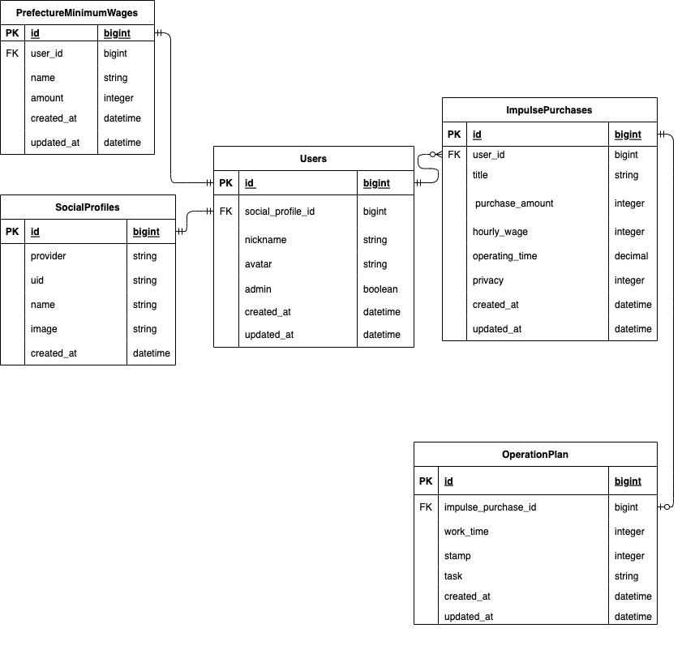

# [I＇ll-buy-that！](https://ill-buy-that.com/)

## サービス概要
衝動買いに費やした金額を元に労働時間を算出し、
衝動買い防止または衝動買い後のメンタルケアを目的にしたサービスです。

## このサービスへの思い・作りたい理由
衝動買いについての選択肢を増やす目的でこのサービスを考案しました。
そもそもは自身が実践してる自己流のライフハックです。
とある匿名コミュニティにて内容を発信したところ
思いのほか反響があり、形にしてみるのも面白いかもと思いました。

具体的な内容は
衝動買いをしたら
(衝動買い金額)÷（時給）＝（稼働時間）
で算出された稼働時間分を普段しないことにあてる。
結果、放置されていた事柄は前進し、衝動買いの罪悪感・後悔は減り、欲しいものは手に入る。
そのような衝動買い肯定ライフハックです。

普段しないこと例：普段手をつけない箇所の掃除、後回しになっているコレクション品整理、着ていない服の整理、
積まれ放置されている書籍に手をつける、筋トレ、運動etc....

自分はECサイトを周回するのが好き且つ購買意欲を掻き立てるものに釣られやすいタイプです。
そのため購入ボタンを押してしまった後の金額を見て後悔することがしょっちゅうあります。
しかし、「自分が欲しいと思ったもの買ってなんで後悔してんだ！！」とも思います。
この後悔を抱いたまま残してしまうことにモヤモヤを感じていたので
『衝動買いの防止』だけではなく『購入後の後悔』の行き場も作ろうと考え、実践していたのが上記の自己流ライフハックです。

以上のことから、衝動買い後の罪悪感や後悔を行動力へ変換するお手伝いもできる衝動買い欲管理サービスを作ろうと思い立ちました。
同じような思いを抱えている方の助けになるようなツールにしていきたいです。

## 利用イメージ
思い立った際に気軽に開けて分かりやすい結果が得られる。
例：  ◯◯◯円購入で　◯◯時間の稼働
それによって購入するか否かの決断をスムーズできる。
または、購入を決断した後の稼働時間消化のスタンプカードを作成。

## 差別化
衝動買いを未然に防止するという目的だけではなく、衝動買いをしてもよいという選択肢を提示できる。

## 機能
- 会員登録機能
- ログイン機能
- 診断結果の作成、保存
  - 内容
    - タイトル
    - 詳細コメント
    - 作成日時
    - (衝動買い金額) ÷（時給）＝（稼働時間）
    - 購入を見送った or 購入した
      - 購入した を選んだ場合、（稼働時間）を消化するためのスタンプカード作成
        - 稼動する期間
        - 1日の（稼働時間）
        - 稼働中にやること
- 過去に作成した診断結果の一覧表示
- 問い合わせ機能

## 機能の実装方針予定
- LINE連携機能
- X連携機能
- SNS共有機能

## ER図

## 画面遷移図
[画面遷移図](https://www.figma.com/design/d2O7EGcTOsYNRaywy2BxNn/%E3%80%90%E6%8F%90%E5%87%BA%E7%94%A8%E3%80%91I'll-buy-that%EF%BC%81!?node-id=0-1&t=UGFREQ1tvIcOoOeb-1)
